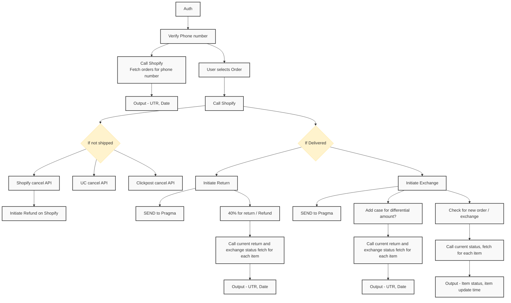

# API Flows

This document contains the Mermaid flowchart representing the "API Flows" section of the architecture diagram.

```mermaid
graph TD
    %% Main Authentication and Order Fetching
    Auth[Auth] --> VerifyPhone[Verify Phone number]
    VerifyPhone --> CallShopifyOrders[Call Shopify<br>Fetch orders for phone number]
    VerifyPhone --> UserSelects[User selects Order]
    
    CallShopifyOrders --> OutputUTR[Output - UTR, Date]
    
    UserSelects --> CallShopifyStatus[Call Shopify]
    CallShopifyStatus --> IfNotShipped{If not shipped}
    CallShopifyStatus --> IfDelivered{If Delivered}
    
    %% Not Shipped Flow (Cancellations)
    IfNotShipped --> ShopifyCancel[Shopify cancel API]
    ShopifyCancel --> InitiateRefund[Initiate Refund on Shopify]
    
    IfNotShipped --> UCCancel[UC cancel API]
    IfNotShipped --> ClickpostCancel[Clickpost cancel API]
    
    %% Delivered Flow (Returns & Exchanges)
    IfDelivered --> InitiateReturn[Initiate Return]
    IfDelivered --> InitiateExchange[Initiate Exchange]
    
    %% Return Logistics
    InitiateReturn --> SendPragmaReturn[SEND to Pragma]
    InitiateReturn --> Return40[40% for return / Refund]
    
    Return40 --> CallReturnStatus1[Call current return and exchange status fetch for each item]
    CallReturnStatus1 --> OutputUTRDate1[Output - UTR, Date]
    
    %% Exchange Logistics
    InitiateExchange --> SendPragmaExchange[SEND to Pragma]
    InitiateExchange --> AddCaseDiff[Add case for differential amount?]
    AddCaseDiff --> CallReturnStatus2[Call current return and exchange status fetch for each item]
    CallReturnStatus2 --> OutputUTRDate2[Output - UTR, Date]
    
    InitiateExchange --> CheckNewOrder[Check for new order / exchange]
    CheckNewOrder --> CallCurrentStatus[Call current status, fetch for each item]
    CallCurrentStatus --> OutputItemStatus[Output - Item status, item update time]

    classDef default fill:#f9f9f9,stroke:#333,stroke-width:2px;
    classDef decision fill:#fff3cd,stroke:#ffeeba,stroke-width:2px;
    class IfNotShipped,IfDelivered decision;
```
