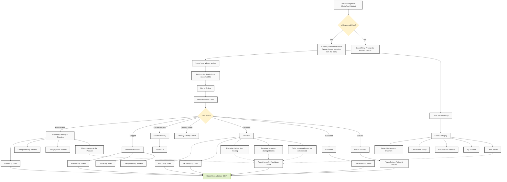

# To-Be Flow

This document contains the Mermaid flowchart representing the proposed user journey and chat flows ("To-Be Flow") for the chatbot.

```mermaid
graph TD
    %% Entry Point
    Start[User messages on WhatsApp / Widget] --> CheckUser{Is Registered User?}
    
    %% User Validation
    CheckUser -->|Yes| Welcome[Hi Name, Welcome to Store<br>Please choose an option from the menu]
    CheckUser -->|No| GuestFlow[Guest Flow: Prompt for Phone/Order ID]
    
    %% Main Menu
    Welcome --> MenuHelpOrders[I need help with my orders]
    Welcome --> MenuFAQs[Other Issues / FAQs]
    
    %% Order Flow
    MenuHelpOrders --> FetchOrders[Fetch order details from Shopify/OMS]
    FetchOrders --> ShowOrders[List of Orders]
    ShowOrders --> SelectOrder[User selects an Order]
    
    %% Order Status Router
    SelectOrder --> CheckStatus{Order Status}
    
    %% Pre-Dispatch Branch
    CheckStatus -->|Pre-Dispatch| PreDispatch[Preparing / Ready to Dispatch]
    PreDispatch --> PD_Cancel[Cancel my order]
    PreDispatch --> PD_Address[Change delivery address]
    PreDispatch --> PD_Phone[Change phone number]
    PreDispatch --> PD_Modify[Make changes in the Product]
    PD_Modify -.-> AgentHandoff[Agent Handoff / Freshdesk Ticket]
    
    %% Shipped / In-Transit Branch
    CheckStatus -->|Shipped| Shipped[Shipped / In-Transit]
    Shipped --> SH_Where[Where is my order?]
    Shipped --> SH_Cancel[Cancel my order]
    Shipped --> SH_Address[Change delivery address]
    
    %% Out for Delivery & Attempt Failed
    CheckStatus -->|Out for Delivery| OFD[Out for Delivery]
    OFD --> OFD_Track[Track ETA]
    CheckStatus -->|Delivery Failed| Failed[Delivery Attempt Failed]
    
    %% Delivered Branch
    CheckStatus -->|Delivered| Delivered[Delivered]
    Delivered --> DL_Return[Return my order]
    Delivered --> DL_Exchange[Exchange my order]
    Delivered --> DL_Missing[The order had an item missing]
    Delivered --> DL_Wrong[Received wrong or damaged items]
    Delivered --> DL_NotReceived[Order shows delivered but not received]
    DL_Missing -.-> AgentHandoff
    DL_Wrong -.-> AgentHandoff
    DL_NotReceived -.-> AgentHandoff
    
    %% Cancelled & Returns Branch
    CheckStatus -->|Cancelled| Cancelled[Cancelled]
    Cancelled --> RefundCheck[Check Refund Status]
    
    CheckStatus -->|Returns| Returns[Return Initiated]
    Returns --> RT_Track[Track Return Pickup & Refund]
    
    %% FAQs Branch
    MenuFAQs --> FAQ_Categories[Select Category]
    FAQ_Categories --> FAQ_Delivery[Order, Delivery and Payment]
    FAQ_Categories --> FAQ_Cancel[Cancellation Policy]
    FAQ_Categories --> FAQ_Return[Refunds and Returns]
    FAQ_Categories --> FAQ_Account[My Account]
    FAQ_Categories --> FAQ_Other[Other Issues]
    FAQ_Other -.-> AgentHandoff
    
    %% Global Endpoints
    PD_Cancel --> EndNode[Close Chat & Initiate CSAT]
    SH_Where --> EndNode
    DL_Return --> EndNode
    DL_Exchange --> EndNode
    RefundCheck --> EndNode
    RT_Track --> EndNode
    AgentHandoff --> EndNode

    classDef default fill:#f9f9f9,stroke:#333,stroke-width:2px;
    classDef decision fill:#fff3cd,stroke:#ffeeba,stroke-width:2px;
    classDef global fill:#e2f0cb,stroke:#a4c639,stroke-width:2px;
    class CheckUser,CheckStatus decision;
    class EndNode global;
```
